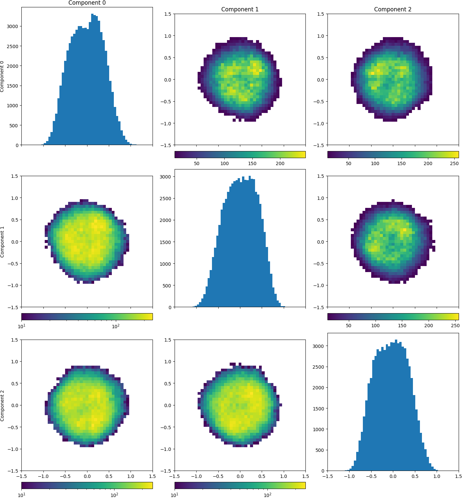

# 3D Flex Coordinate Plotting

This script produces plots of each pair of 3D Flex latent space dimensions.
There are options to turn on or off the linear (top half) and log (bottom half) scaled plots, as well as change the number of bins.

